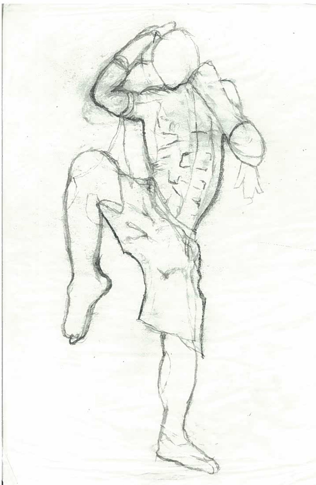
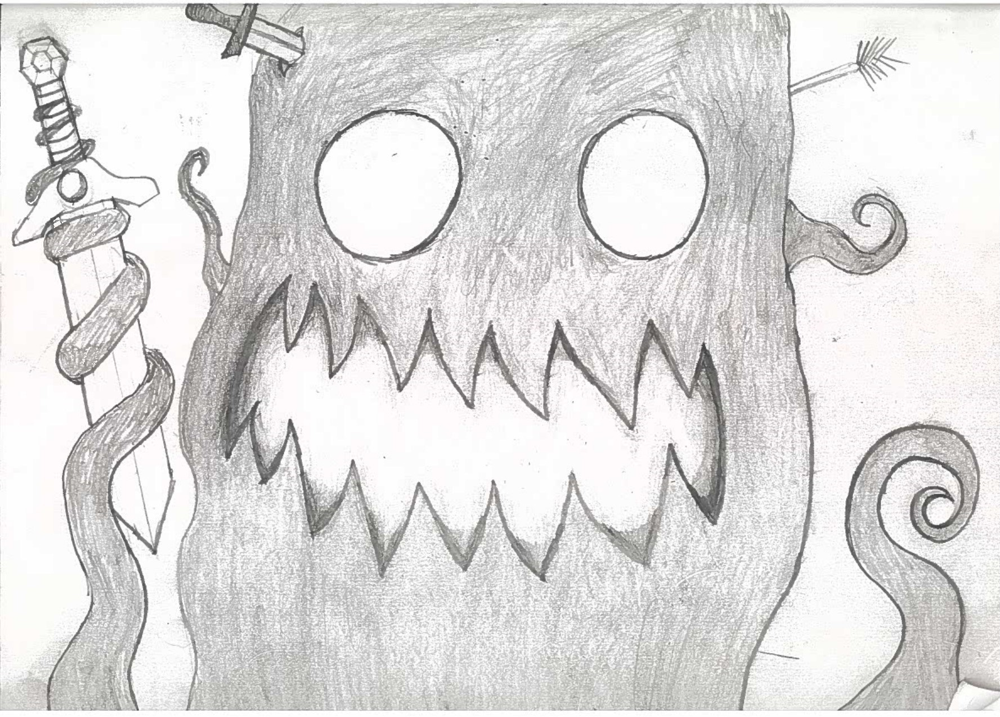
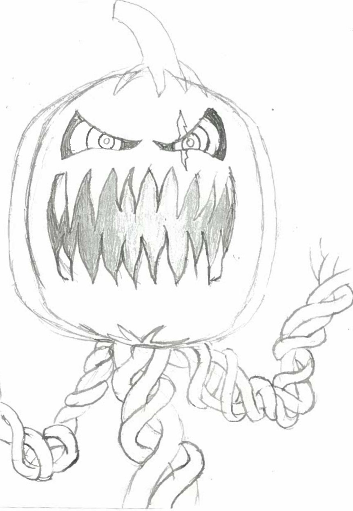
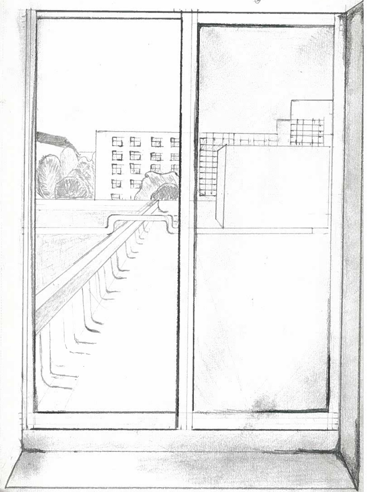

<html lang="en">
<head>
    <meta charset="UTF-8">
       <title>CreatorsHub</title>
    <link rel="icon" type="image/x-icon" href="png-clipart-colored-pencil-pencil-pencil-pen-thumbnail.png">

</head>
<body style="background: url(doogle-3-drawing.jpg) no-repeat fixed;
             background-size: 100%;">

<!--Title/Intro-->

<h1 class="p2" id="rcorners2">World Of Monsters Concept Art   
</h1>

Hello, my name is Wayne Landon Hearns II and my blog is going to be about Concept art. Ever since I was a child I have loved drawing, and as I got older, I realized that there were a lot of routes you can go with drawing. You can go animation, graphic design, Industrial design, Environmental or Comics, but I realized I had passion for being a Monster concept artist/digital illustrator. That is my passion and that is my main goal so I thought it would be cool to post about other different amazing concept artists to motivate others and to share different work from great concept artist that are in the industry.  

</body>

<body background="doogle-2-drawing.jpg">

<!--My Art-->

<h1 class="p2" id="rcorners4"> My Concept Art </h1>

Underground Labatory by Wayne Landon Hearns II

Muay Thai Concept Art by Wayne Landon Hearns II

Portal To My Creative Mind by Wayne Landon Hearns II

Scary Pumpkin Concept Art by Wayne Landon Hearns II

Window View Concept Art by Wayne Landon Hearns II

Unity Of One Flame by Wayne Landon Hearns II

<h1 class="p2" id="rcorners4">Bio</h1>

 Wayne Hearns was born in Detroit, Michigan but has lived in Farmington Hills for most of his life. As he got older, Wayne fell in love with creating monsters, which has become the main focus of his art. As he continues his college education, Wayne remains to be an inspiring digital concept artist that works with 2D, 3D, Video media, and metal sculpting. Wayne graduated from Oakland Community College in 2023 with his associates in his Fine Arts and Technological Sciences and is currently attending Wayne State University for his Bachelor's of Fine Arts with a concetration in digital art. 
 

<h1 class="p2" id="rcorners4">CV</h1>

<U>Education</U>  
  
Oakland Community College  
Bachelor's Degree 
Fine Arts 
Technological Sciences  
Started:2017 
Graduation:2023  
  Wayne State University  
Currently working towards  
Digital art 
Started: Fall 2023 
Expected Graduation:2026 
  
<U>Exhibitions Solo/Group 
Group Exhibition:</U> 
  
2024 Temporal Frames, Art at 
Wayne Open Houses, Detroit, 
Mi, USA
  
<U>Experience</U> 
  
Premiere Pro Experience 
Blu Wedding Films | Utah 
April 9th, 2022-July-2022

 

<h1 class="p2" id="rcorners4">Contact Information</h1>

Email: Landonhearns001@gmail.com

</body>
</html>
